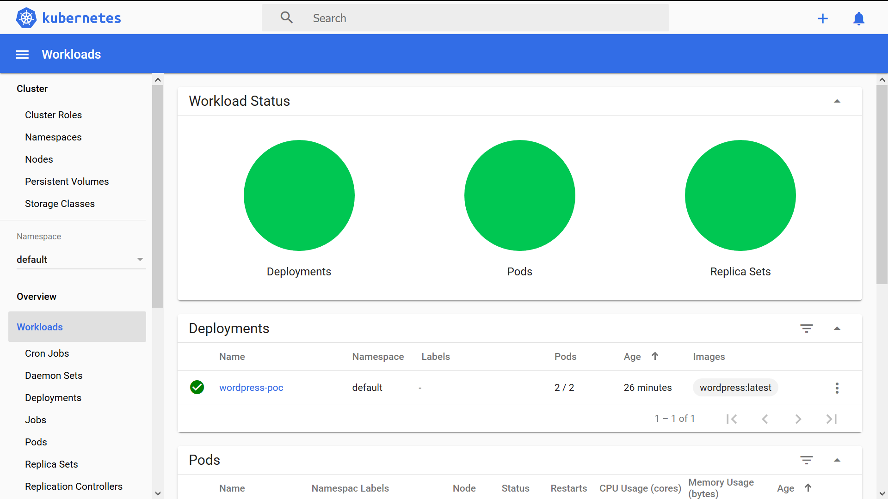
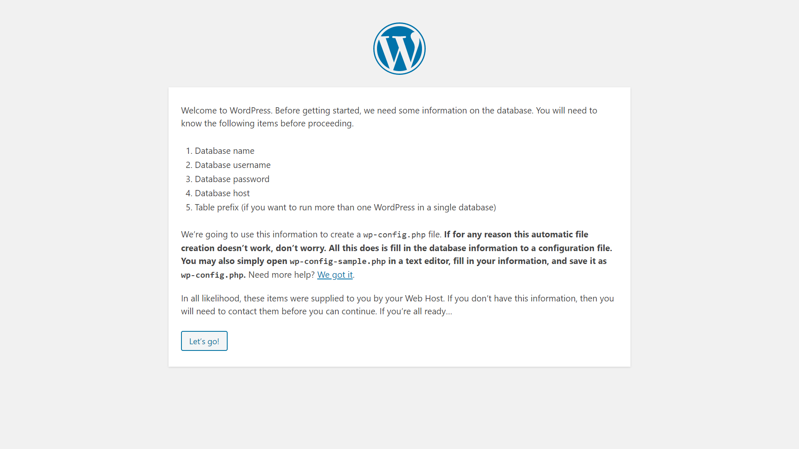

# Kubernetes-poc-wordpress <br>
Configs to show Kuberenetes deployment functionality.

- Here, we can see deployement made to showcase the Kubernetes Proof of Concept by deploying the Wordpress server on a 2 pods that are always available for the traffic.
```
Name:                   wordpress-poc
Namespace:              default
CreationTimestamp:      Thu, 09 Apr 2020 12:19:44 -0500
Labels:                 <none>
Annotations:            deployment.kubernetes.io/revision: 1
Selector:               app=poc-wordpress
Replicas:               2 desired | 2 updated | 2 total | 2 available | 0 unavailable
StrategyType:           RollingUpdate
MinReadySeconds:        0
RollingUpdateStrategy:  25% max unavailable, 25% max surge
```


- Kubernetes deployement from a YAML File `wordpress_1.0.yml` and the replica sets that are created by the Deployement.<br><br>

```
  Type    Reason            Age   From                   Message
  ----    ------            ----  ----                   -------
  Normal  SuccessfulCreate  28m   replicaset-controller  Created pod: wordpress-poc-849fc8bfc5-lk65x
  Normal  SuccessfulCreate  28m   replicaset-controller  Created pod: wordpress-poc-849fc8bfc5-hn8hz
  ```
  
- These replica sets ensure always the given no of pods are availble for the traffic.<br><br>
  
  This can also be seen in the Kubernetes Dashboard (Minikube dashboard in this case) as shown in the image below.<br>


**Now to access the wordpress server that is deployed onto these pods we need to add a service on top of the pods to ensure a consistent IP address and port is assigned irrespective to the pods being respawned with a new IP whenever necessary**. <br><br>

- New service is been deployed using the `svc.yml` file that exposes the Nodeport to the outside world.
This service of the deployment can be seen by accessing the IP and the service port that is assigned as shown below<br><br>

